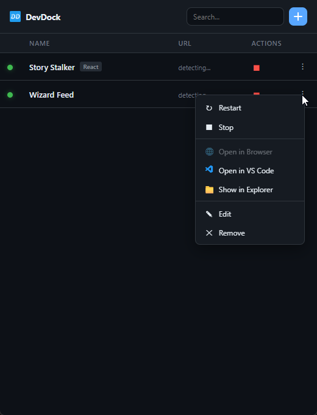

# DevDock

A tiny desktop app to manage your dev servers. One click to start, one click to stop.



## Why

I was building 4 Node.js projects simultaneously with [Claude Code](https://claude.ai/claude-code). Each project needed its own `npm run dev`, so that's 4 extra terminal tabs on top of the 4 Claude Code sessions I already had running. 8 tabs, constantly switching, just to start or stop a dev server. It got out of hand fast.

I just wanted a simple app where I could see all my projects, hit play, and check logs when needed. So I built this with Claude Code, obviously.

## What It Does

- **Add a project folder** and it reads `package.json`, pulls in the name, scripts, and detects the framework
- **One-click play/stop** right on the dashboard
- **Live logs** click a project to see stdout/stderr in real time
- **Auto-detect URLs** when your server prints `localhost:3000`, it becomes a clickable link
- **Context menu** run any script, open in VS Code, open in browser, show in explorer
- **Persistent** your projects and commands are saved locally

## Getting Started

### Prerequisites

- [Node.js](https://nodejs.org/) 18+
- [Rust](https://rustup.rs/)
- Windows: [VS Build Tools](https://visualstudio.microsoft.com/visual-cpp-build-tools/) with C++ workload

### Run

```bash
git clone https://github.com/evil1morty/devdock.git
cd devdock
npm install
npx tauri dev
```

### Build

```bash
npx tauri build
```

Output: `src-tauri/target/release/devdock.exe` (~9MB)

## Stack

Tauri v2 + Rust backend + vanilla JS frontend. No bundler, no framework.

## License

MIT
