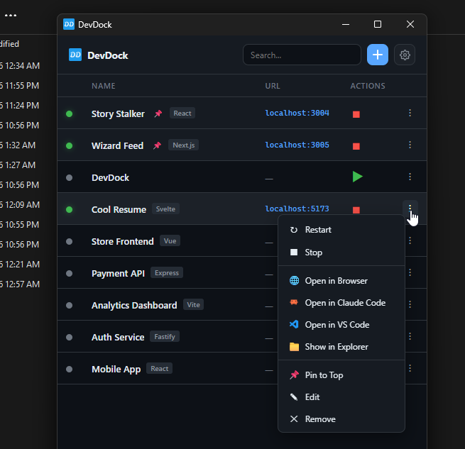

<p align="center">
  
</p>
<h1 align="center">OneRun</h1>
<p align="center">One app to run them all.</p>

<p align="center">
  
</p>

## Why

I was working on multiple projects simultaneously with [Claude Code](https://claude.ai/claude-code). Each project needed its own dev server running, so for every project that's another terminal tab, plus the terminals for Claude Code itself. It started getting frustrating real quick, constantly switching between tabs just to start or stop a server.

I just wanted a simple app where I could see all my projects, hit play, and check logs when needed. So I built this with Claude Code.

## Features

- **Auto-scan projects** reads `package.json`, `Cargo.toml`, `composer.json`, `go.mod`, `Makefile`, `docker-compose.yml` and pulls in name, scripts, and framework
- **One-click play/stop** right on the dashboard
- **Live logs** click a project to see stdout/stderr in real time
- **Auto-detect URLs** when your server prints `localhost:3000`, it becomes a clickable link
- **Open in Claude Code** opens a terminal at the project and runs your configured claude command
- **Open in editor** VS Code, Cursor, or any editor you set
- **Pin projects** to keep your most-used ones at the top
- **Context menu** run any script, open in browser, show in explorer, edit, remove
- **Settings** configure claude command with flags, editor, theme (dark/light/system), window size
- **Framework detection** badges for Next.js, Vite, Svelte, React, Vue, Angular, Express, Laravel, Django, and more
- **Cross-platform** Windows, macOS, Linux
- **Detects package manager** uses bun, pnpm, yarn, or npm based on your lockfile

## Download

Grab the latest release for your platform from [Releases](https://github.com/evil1morty/onerun/releases).

| Platform | File |
|----------|------|
| Windows | `.exe` or `.msi` |
| macOS | `.dmg` |
| Linux | `.deb` |

## Build from Source

Requires [Node.js](https://nodejs.org/) 18+, [Rust](https://rustup.rs/), and on Windows [VS Build Tools](https://visualstudio.microsoft.com/visual-cpp-build-tools/) with C++ workload.

```bash
git clone https://github.com/evil1morty/onerun.git
cd onerun
npm install
npx tauri build
```

## License

MIT
